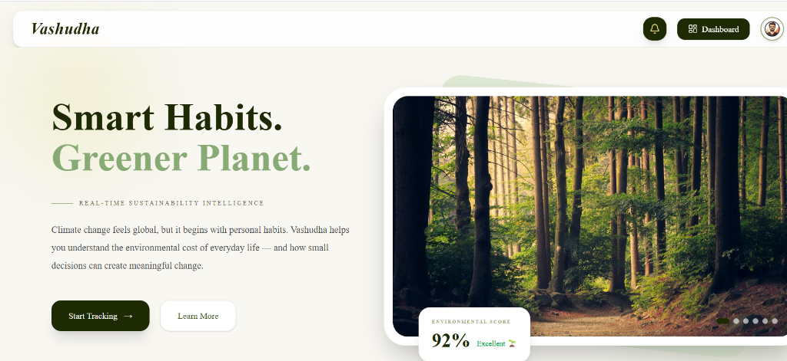

# 🌍 Vashudha

### Smart Habits. Greener Planet.



<<<<<<< HEAD
Vashudha is a modern, full-stack **Carbon Footprint Tracker** designed to empower individuals and communities with real-time sustainability intelligence. Climate change feels global, but it begins with personal habits. Vashudha helps you understand the environmental cost of everyday life — and how small decisions can create meaningful change.

=======
>>>>>>> 6497aa420ccecbb334ff3217cc2df3ec41851150
---

## ✨ Features

### 🔐 Authentication System
<<<<<<< HEAD
- **Secure Access**: Secure login and signup system with protected JWT-based user authentication.
- **Session Management**: Session persistence using secure HTTP-only cookies.
=======
Secure login and signup system with protected user access.
>>>>>>> 6497aa420ccecbb334ff3217cc2df3ec41851150

---

### 🌱 Smart Carbon Footprint Calculator
<<<<<<< HEAD
- **Activity Logging**: Log daily activities across multiple categories including transport, diet, energy usage, and waste.
- **Precise Calculations**: Dynamic emission calculators powered by verified carbon factors.
=======
Track your daily environmental impact through intelligent carbon calculations.
>>>>>>> 6497aa420ccecbb334ff3217cc2df3ec41851150

---

### 🤖 AI Suggestions
<<<<<<< HEAD
- **Smart Recommendations**: Get tailored, actionable suggestions powered by the Gemini AI API.
- **Habit Building**: Adaptive recommendations based on your historical carbon logging history.
=======
Get smart AI-powered recommendations to reduce your carbon footprint and build sustainable habits.
>>>>>>> 6497aa420ccecbb334ff3217cc2df3ec41851150

---

### 📊 Smart Dashboard
<<<<<<< HEAD
- **Carbon Analytics**: Interactive charts showing category-wise carbon expenditure.
- **Environmental Score**: Real-time evaluation of your sustainability metrics with dynamic grade feedback.
- **Progress Tracking**: Compare weekly and monthly emissions to keep track of your reduction goals.
=======
Interactive dashboard showing:
- Carbon analytics
- Environmental score
- Progress tracking
- Sustainability insights
>>>>>>> 6497aa420ccecbb334ff3217cc2df3ec41851150

---

### 🔔 Notification System
<<<<<<< HEAD
- **Sustainability Alerts**: Live updates, alerts, and eco-friendly reminders via real-time WebSocket connections.
- **System Updates**: Keep up-to-date with carbon goals and community achievements.
=======
Receive important sustainability alerts, reminders, and environmental updates.
>>>>>>> 6497aa420ccecbb334ff3217cc2df3ec41851150

---

### 👥 Community Chat Section
<<<<<<< HEAD
- **Real-Time Forum**: Connect with eco-conscious peers, exchange sustainable ideas, and discuss green topics in a live room.
- **Instant Messaging**: Seamless chat experience powered by Socket.io.
=======
Connect with people, share eco-friendly ideas, and discuss sustainability topics.
>>>>>>> 6497aa420ccecbb334ff3217cc2df3ec41851150

---

### 🌐 Multilingual Support
<<<<<<< HEAD
- **Bilingual Interface**: Accessible UI with full English and Hindi language support.
- **Dynamic Localization**: Instantly toggle preferences across pages.
=======
Accessible experience with bilingual/multilingual support.
>>>>>>> 6497aa420ccecbb334ff3217cc2df3ec41851150

---

### 🏙️ Metropolitan Environmental Data
<<<<<<< HEAD
Real-time environmental and carbon-related insights from major metropolitan cities. Vashudha aggregates live telemetry for key air-quality parameters (PM2.5, PM10, CO) and maps them alongside regional per-capita emission drivers.

#### 📊 Live City Telemetry & Emissions Diagnostics

Here is the environmental and carbon data for India's major metropolitan hubs, as integrated into Vashudha's live telemetry map:

| City | Region / State | Coordinates | Annual CO₂ Total | Per Capita Rate | Top Emissions Driver |
| :--- | :--- | :---: | :---: | :---: | :--- |
| 🏙️ **Delhi** | National Capital Region | `28.61° N, 77.20° E` | **38.4M t** | **1.85 t/yr** | 🚗 Vehicular Combustion & Road Dust |
| 🏙️ **Mumbai** | Maharashtra | `19.07° N, 72.87° E` | **22.8M t** | **1.42 t/yr** | 🚢 Thermal Power & Marine Freight |
| 🏙️ **Bangalore** | Karnataka | `12.97° N, 77.59° E` | **15.2M t** | **1.28 t/yr** | 🏢 Commercial Hub Energy & Grid Use |
| 🏙️ **Chennai** | Tamil Nadu | `13.08° N, 80.27° E` | **12.6M t** | **1.18 t/yr** | 🏭 Petrochemicals & Auto Manufacture |
| 🏙️ **Hyderabad** | Telangana | `17.38° N, 78.48° E` | **11.4M t** | **1.12 t/yr** | 💻 Tech Corridor Energy & Construction |
| 🏙️ **Patna** | Bihar | `25.59° N, 85.13° E` | **5.1M t** | **0.85 t/yr** | 🌾 Agricultural Biomass & Brick Kilns |

> [!NOTE]
> Live telemetry air-quality indices (PM2.5, PM10, CO) are pulled in real-time via the Open-Meteo Air Quality API based on coordinates specified above.

---

## 🛠️ Tech Stack

### Frontend
- **Framework:** Next.js 16 (React 19)
- **Styling:** Tailwind CSS v4 & Framer Motion (for premium micro-animations)
- **Charts & 3D Globe:** Recharts & Three.js / React Three Fiber / Drei
- **Internationalization:** i18next
- **Sockets:** Socket.io-client

### Backend
- **Runtime:** Node.js (Express v5)
- **Database:** MongoDB (via Mongoose)
- **AI Intelligence:** `@google/generative-ai` (Gemini API)
- **Real-Time Events:** Socket.io
- **Media Uploads:** Cloudinary & Multer

---

## 🚀 Getting Started

### Prerequisites
- Node.js (v18 or higher recommended)
- MongoDB instance (local or Atlas)
- Gemini AI API Key
- Cloudinary Account (for image uploads)

### Setup Instructions

1. **Clone the Repository**
   ```bash
   git clone <repository-url>
   cd Carbon-Footprint-Tracker
   ```

2. **Backend Setup**
   ```bash
   cd server
   npm install
   ```
   Create a `.env` file in the `server` directory and add:
   ```env
   PORT=5000
   MONGO_URI=<your_mongodb_uri>
   JWT_SECRET=<your_jwt_secret>
   GEMINI_API_KEY=<your_gemini_api_key>
   CLOUDINARY_CLOUD_NAME=<your_cloudinary_name>
   CLOUDINARY_API_KEY=<your_cloudinary_key>
   CLOUDINARY_API_SECRET=<your_cloudinary_secret>
   ```
   Start the backend server:
   ```bash
   npm run dev
   ```

3. **Frontend Setup**
   ```bash
   cd ../client
   npm install
   ```
   Start the Next.js development server:
   ```bash
   npm run dev
   ```
   Open [http://localhost:3000](http://localhost:3000) to view the application.
=======
Real-time environmental and carbon-related insights from major metropolitan cities.

---

## 💚 Vision

Vashudha aims to encourage people to adopt small sustainable habits that collectively create a greener and healthier planet.

```
>>>>>>> 6497aa420ccecbb334ff3217cc2df3ec41851150
